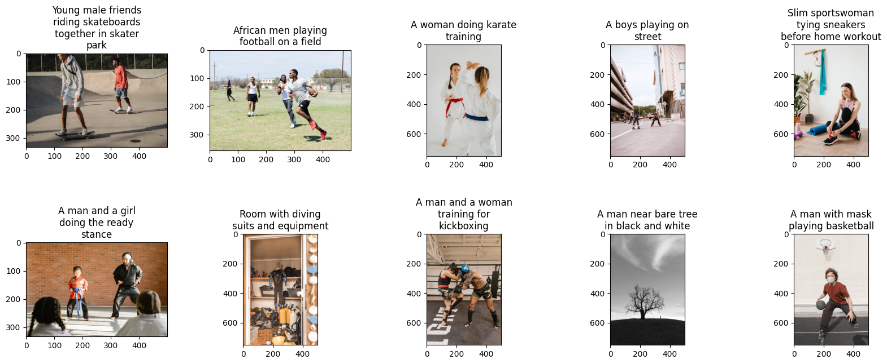
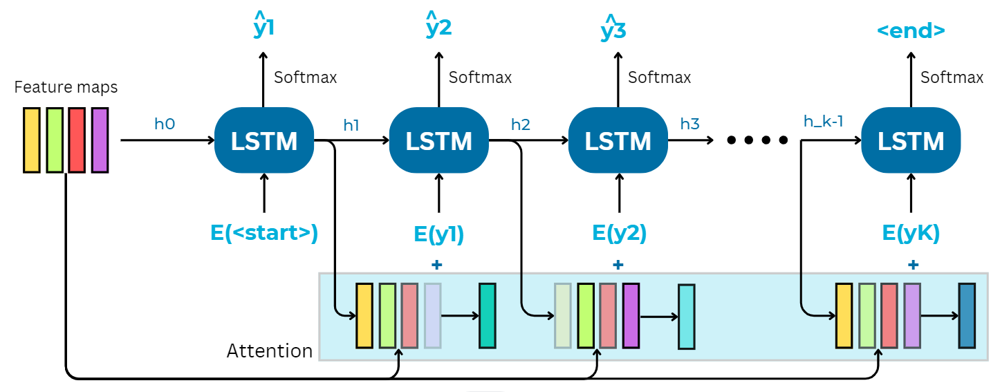
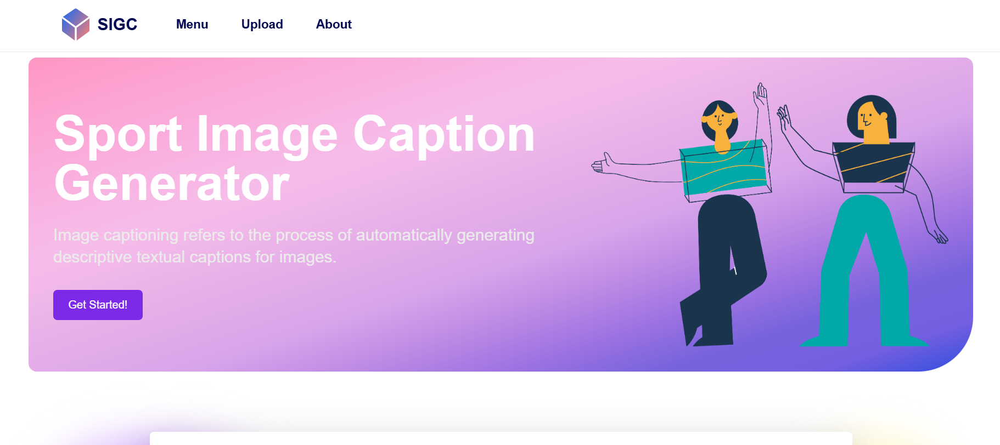
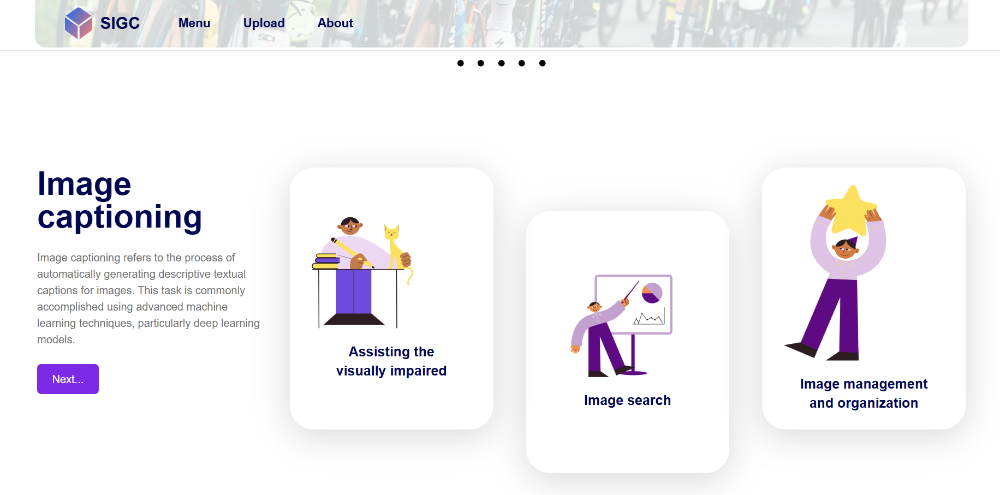
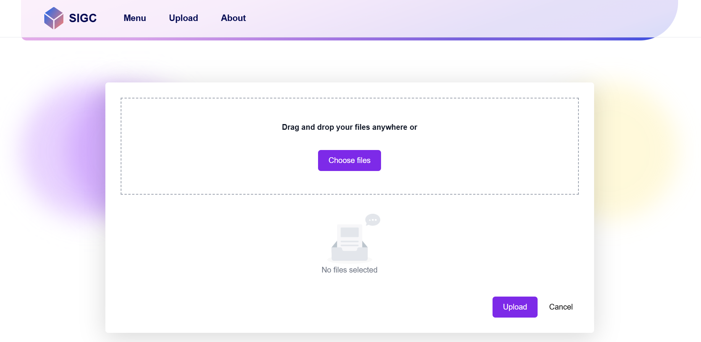

## Image Captioning

### Introduction
This is our **group project** in **Course MAT3534 - Data Mining**. This repo was forked from [our original source](https://github.com/uyenhoang06/datamining-image-caption-generate), which I have made some modifications for personal purpose.

#### 1. Learning objectives
- learn about the entire process of data management and utilization for knowledge extraction to support business decisions makings
- learn about the **4 major data mining techniques** including regression, classification, clustering, association rules and how to apply each method for different tasks and purposes

#### 2. About this project
- summary: this project aims to provide a comprehensive solution for **generating captions for images related to sports**
- topics covered: image captioning, encoder-decoder architecture, attention mechanism, neural network, transfer learning, word embedding
- tech stack: **PyTorch, ReactJS, Flask, Selenium**
- results:
    + implemented proposed model architecture, resulting in better accuracy with BLEU-1 score of 55% and BLEU-2 of 29%
    + experimented different variants to assess the usefulness of each aspect contributing to the overall performance

---

### Overview

#### 1. Dataset
- For learning purpose, we have built a custom dataset containing **15,602 sport-related images along with captions** (1 cap per image) through varios stock photo websites
- For training process, we also use the Flick8k dataset for comparison and evaluation

#### 2. Architecture
We followed the implementation described in the [_Show, Attend, and Tell_](https://arxiv.org/abs/1502.03044) paper, with reference to [this tutorial](https://github.com/sgrvinod/a-PyTorch-Tutorial-to-Image-Captioning).  
The main idea is that we used an **Encoder-Decoder architecture** with **Attention mechanism**, where the Encoder encodes the image into its feature maps, the Decoder *translates* it word by word into a sequence and the Attention layer helps the model focus on different parts of the image at different point in the inferred sequence.

#### 3. Interface
Some of the snapshots of our web application. Since this application was mainly dedicated to our final project, we have yet to deployed it on any server or hosting (we are learning how to) so unfortunately there isn't official link to the website in the meantime.

#### 4. Some questions or problems to keep me engage
- research and experiment other architecture, for instance, transformer
- working on training text embedding model seperately vs using pretrained weights (GloVe)

---

### Installation
Before you begin, ensure you have met the following requirements:

- [Python](https://www.python.org/downloads/) (version 3.10+)
- [Node.js](https://nodejs.org/) (version 17+)
- [npm](https://www.npmjs.com/get-npm)

#### Step 1: Clone the Repository

Start by cloning the repository to your local machine using:

`git clone https://github.com/thaonguyen-hoang/image-caption-generator.git`

#### Step 2: Backend set up 
  `pip install -r requirements.txt`
  
  `python app.py`

#### Step 3: Frontend set up
`cd myfront`

`npm install`

`npm run dev`

